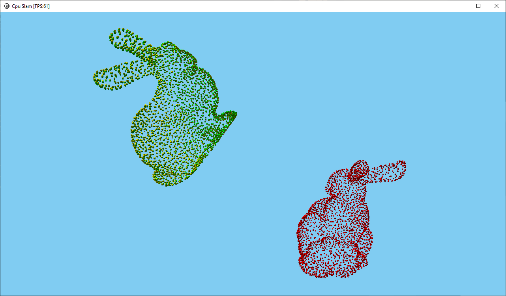
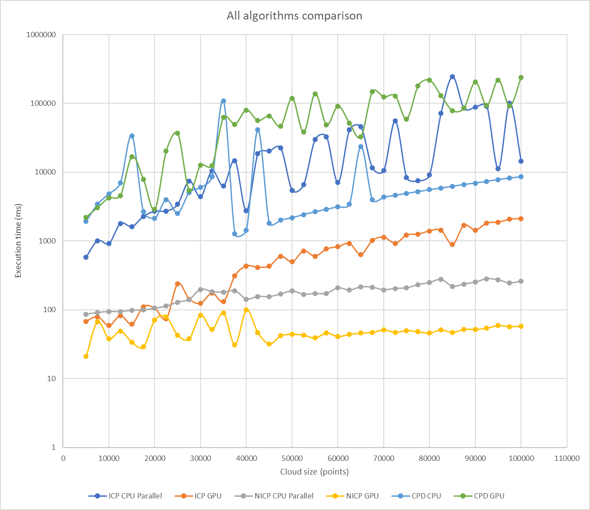

# CUDA SLAM

> Implementation of different Point set registration algorithms using CUDA library.

## Implemented algorithms
- Iterative Closest Point
- Non-iterative Closest Point
- Coherent Point Drift

## Documentation
For detailed project description compile [LaTeX documentation](doc/documentation.tex).

## Requirements
- Windows 10 x64
- CUDA Toolkit 10.2

## Performance

## Team
| Mateusz Śliwakowski | Michał Rogala | Szymon Stasiak  |
| :---: |:---:| :---:|
|  |  |  |
| <a href="http://github.com/Sliwson" target="_blank">`github.com/Sliwson`</a> | <a href="http://github.com/Rogal27" target="_blank">`github.com/Rogal27`</a> | <a href="http://github.com/szymon159" target="_blank">`github.com/szymon159`</a> |
